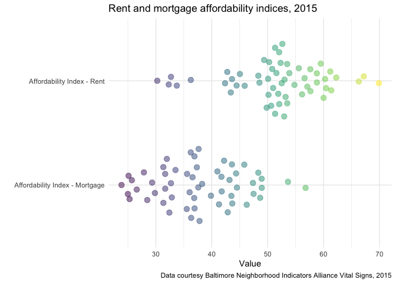

<!-- README.md is generated from README.Rmd. Please edit that file -->

# baltimoredata

<!-- badges: start -->
<!-- badges: end -->

The goal of baltimoredata is to make data related to Baltimore City,
Maryland more accessible and consistent for R users. The package is
designed to work well with the
[mapbaltimore](https://elipousson.github.io/mapbaltimore/) and
[bcpss](https://elipousson.github.io/bcpss/) packages that I am also
developing.

Currently, this package only includes two data sets: the Baltimore
Neighborhood Indicators Alliance (BNIA) Vital Signs data between 2010
and 2018 and the definitions for the variables included in the Vital
Signs data.

## Installation

You can install baltimoredata with the remotes package:

``` r
remotes::install_github("elipousson/baltimoredata")
```

## Example

``` r
library(baltimoredata)
library(dplyr)
#> 
#> Attaching package: 'dplyr'
#> The following objects are masked from 'package:stats':
#> 
#>     filter, lag
#> The following objects are masked from 'package:base':
#> 
#>     intersect, setdiff, setequal, union
library(ggplot2)
```

The BNIA Vital Signs data is useful for making comparisons between
different areas of the city, between multiple years, and multiple
related variables. For example, see the beeswarm plot below comparing
the BNIA affordability indices for rent and mortgage:

``` r
vital_signs_2010_2018 %>% 
  filter(indicator %in% c("affordability_index_mortgage", "affordability_index_rent"),
         year == 2015) %>% 
  ggplot(aes(x = label, y = value, color = value)) +
  ggbeeswarm::geom_quasirandom(alpha = 0.5, size = 3) +
  coord_flip() +
  theme_minimal() +
  scale_color_viridis_c(guide = FALSE) +
  labs(title = "Rent and mortgage affordability indices, 2015",
       x = "",
       y = "Value",
       caption = "Data courtesy Baltimore Neighborhood Indicators Alliance Vital Signs, 2015")
```



Note that all BNIA Vital Signs Indicators are available for all years.
The `vital_signs_indicators` provides labels, definitions, and the years
available for all BNIA Vital Signs.

``` r
glimpse(vital_signs_indicators)
#> Rows: 177
#> Columns: 7
#> $ label                <chr> "Total Population", "Total Male Population", "Tot…
#> $ section              <chr> "Census Demographics", "Census Demographics", "Ce…
#> $ source               <chr> "U.S. Census Bureau", "U.S. Census Bureau", "U.S.…
#> $ normalization_source <chr> NA, NA, NA, NA, NA, NA, NA, NA, NA, NA, NA, NA, N…
#> $ definition           <chr> "The total number of persons of all ages that liv…
#> $ indicator            <chr> "total_population", "total_male_population", "tot…
#> $ years_available      <list> [2010, 2010, 2010, <2010, 2016, 2017, 2018>, <20…
```
